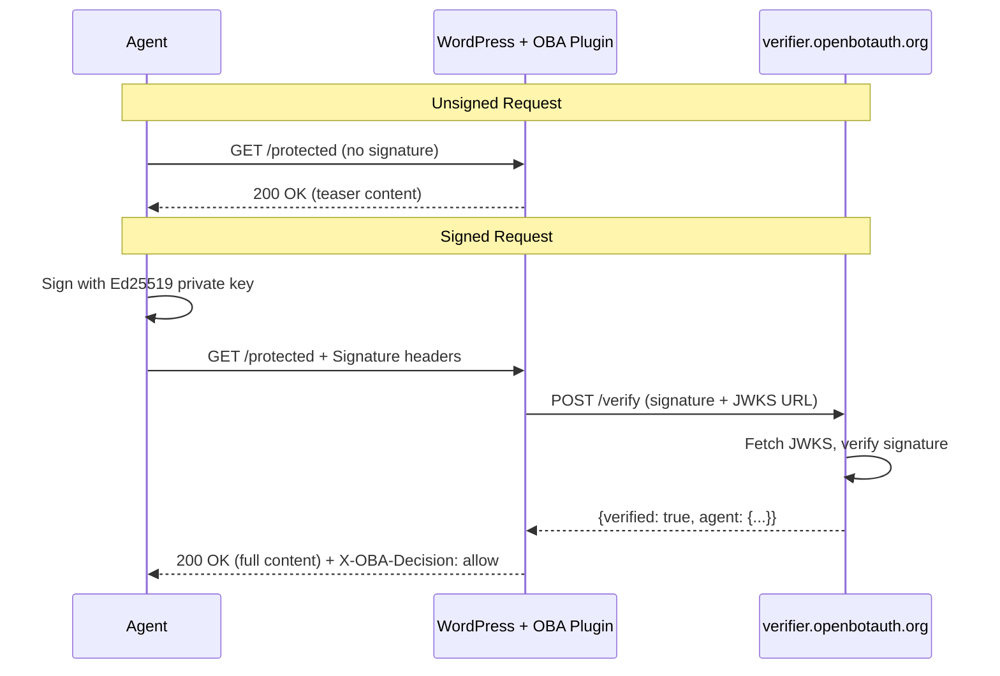

# OpenBotAuth Demos

**Proof-of-concept demos showing RFC 9421 HTTP Message Signatures for agent authentication:**
- **Unsigned agent** → teaser or 402 Payment Required
- **Signed agent** (Ed25519 + JWKS) → full content

This repository contains standalone demo applications that integrate with the [OpenBotAuth](https://github.com/hammadtq/openbotauth) ecosystem.

---

## What It Does

These demos prove a simple concept: agents that cryptographically identify themselves get full access, while unsigned agents see limited content:

1. **Unsigned fetch** → Origin returns teaser (first N words) or 402 response
2. **Signed fetch** → Origin validates signature via RFC 9421, returns full content with `X-OBA-Decision: allow`

**No CDN lock-in.** The origin server (WordPress + OpenBotAuth plugin) performs verification using the OpenBotAuth verifier service.

---

## Demos Included

### 1. Python LangChain Agent (`examples/langchain-agent/`)

Command-line demo showing unsigned vs signed HTTP requests:

```bash
# Unsigned request (gets teaser or 402)
python demo_agent.py --mode unsigned

# Signed request (gets full content)
python demo_agent.py --mode signed
```

**Features:**
- RFC 9421 HTTP Message Signatures
- Ed25519 signing
- Clear terminal output showing headers and content differences
- Optional LangChain integration for content summarization

### 2. Web Widget (`apps/widget-backend/` + `apps/widget-frontend/`)

Interactive web UI demonstrating signed fetch with visual diff:

- Enter any URL protected by OpenBotAuth
- Toggle between unsigned/signed modes
- See request headers, response status, and body preview
- Visual diff showing added signature headers

### 3. TAP Voice Agents (`apps/tap-voice-agents-backend/` + `apps/tap-voice-agents-frontend/`)

**Premium fashion shopping experience** demonstrating Visa TAP-style agentic commerce with OpenBotAuth:

```bash
# Terminal 1: Start backend
pnpm dev:tap-voice-backend
# Runs on http://localhost:8090

# Terminal 2: Start frontend
pnpm dev:tap-voice-frontend
# Runs on http://localhost:5175
```

**Features:**
- **Two Voice Agents**: Pete (shopping) + Penny (payment) via ElevenLabs Conversational AI
- **TAP-Style Signing**: RFC 9421 HTTP Message Signatures + application-level signatures for `agenticConsumer` and `agenticPaymentContainer` objects
- **Live Sequence Diagram**: Real-time visualization with OpenBotAuth swimlanes (Agent, Merchant, OBA Verifier, OBA Registry, Visa)
- **DevTools Panel**: Inspect HTTP headers, TAP objects, and raw requests
- **Origin-First Verification**: Merchant backend calls `https://verifier.openbotauth.org/verify` directly (no CDN dependency)
- **Premium UI**: Glass morphism design, smooth phase transitions, and live SSE updates

**User Flow:**
1. Browse 8 men's fashion products
2. Add items to cart via Pete (voice or manual controls)
3. Say "checkout" to hand off to Penny
4. Authorize payment via voice consent
5. Watch real-time sequence diagram as payment flows through:
   - Agent → Merchant (signed request)
   - Merchant → OBA Verifier (signature verification)
   - OBA Verifier → OBA Registry (JWKS fetch)
   - Merchant validates TAP objects
   - Merchant → Visa (payment authorization)
   - Success response back to Agent

**Security:** Triple-layer signing with shared nonce across HTTP signature and both TAP objects, 8-minute time-bound sessions, origin-side verification.

See [apps/tap-voice-agents-backend/README.md](apps/tap-voice-agents-backend/README.md) and [apps/tap-voice-agents-frontend/README.md](apps/tap-voice-agents-frontend/README.md) for detailed setup.

---

## Quick Start

📚 **For fastest setup, see [QUICKSTART.md](QUICKSTART.md)** — includes automated key configuration.

### Prerequisites

1. **Node.js 20+** and **pnpm 8+**
2. **Python 3.10+** (for agent demo)
3. **Ed25519 keypair** registered with OpenBotAuth registry
4. **Target URL** with OpenBotAuth plugin (default: `https://blog.attach.dev/?p=6`)

### 1. Generate Keys

**Option A: Use existing OpenBotAuth registry** (recommended)

Visit the [OpenBotAuth Registry Portal](https://registry.openbotauth.org) or run locally:

```bash
# In the main openbotauth repo
cd packages/bot-cli
pnpm install
pnpm dev keygen
# Follow prompts to generate and register keys
```

**Option B: Generate standalone keys** (for testing)

```bash
# Using OpenSSL
openssl genpkey -algorithm ed25519 -out private_key.pem
openssl pkey -in private_key.pem -pubout -out public_key.pem
```

### 2. Configure Environment

**Automatic (Recommended):**

If you downloaded keys from the OpenBotAuth website:

```bash
# For root .env (widget demo)
node scripts/parse-keys.js path/to/openbotauth-keys-username.txt

# For specific app directories (uses .env.example as template)
node scripts/parse-keys.js path/to/openbotauth-keys-username.txt apps/tap-voice-agents-backend

# For Python agent
cd examples/langchain-agent
python parse_keys.py path/to/openbotauth-keys-username.txt
```

**Note**: When using an app-specific directory, the script will:
1. Use that app's `.env.example` as a template
2. Replace only the `OBA_*` placeholders
3. Leave other fields for you to fill in (like ElevenLabs API keys)

**Manual:**

```bash
# Copy example config
cp .env.example .env

# Edit .env and add your keys
# - OBA_PRIVATE_KEY_PEM: Your Ed25519 private key (PEM format)
# - OBA_PUBLIC_KEY_PEM: Your Ed25519 public key (PEM format)
# - OBA_KID: Your key ID from the registry
# - OBA_SIGNATURE_AGENT_URL: Your JWKS URL from the registry
```

### 3. Run Python Agent Demo

```bash
cd examples/langchain-agent

# Create virtual environment
python3 -m venv .venv
source .venv/bin/activate  # On Windows: .venv\Scripts\activate

# Install dependencies
pip install -r requirements.txt

# Configure keys (if not already done)
python parse_keys.py path/to/openbotauth-keys-username.txt

# Test unsigned (should get teaser/402)
python demo_agent.py --mode unsigned --url https://blog.attach.dev/?p=6

# Test signed (should get full content)
python demo_agent.py --mode signed --url https://blog.attach.dev/?p=6
```

**Expected output:**

- **Unsigned**: `Status: 200` with `[TEASER]` indicator, limited content
- **Signed**: `Status: 200` with `X-OBA-Decision: allow` header, full content

**Note:** Some origin servers may be slow or rate-limited. If you encounter timeouts, try alternative URLs or wait a moment before retrying.

### 4. Run Web Widget

```bash
# Install all dependencies
pnpm install

# Configure keys for backend (if not already done)
node scripts/parse-keys.js path/to/openbotauth-keys-username.txt

# Terminal 1: Start backend
pnpm dev:widget-backend
# Runs on http://localhost:8089

# Terminal 2: Start frontend
pnpm dev:widget-frontend
# Runs on http://localhost:5174
```

Open http://localhost:5174 in your browser:

1. Enter URL: `https://blog.attach.dev/?p=6`
2. Click "Fetch Unsigned" → see teaser
3. Click "Fetch Signed" → see full content + signature headers

---

## How It Works



**Signature Format (RFC 9421):**

```
Signature-Input: sig1=("@method" "@authority" "@path");created=1234567890;expires=1234568190;nonce="abc123";keyid="key-001";alg="ed25519"
Signature: sig1=:SGVsbG8gV29ybGQK...:
Signature-Agent: https://registry.openbotauth.org/jwks/username.json
```

**Components signed:**
- `@method`: HTTP method (GET, POST, etc.)
- `@authority`: Host + port (e.g., `blog.attach.dev`)
- `@path`: Path + query string (e.g., `/?p=6`)

**Key details:**
- Algorithm: Ed25519 (EdDSA)
- Signature encoding: base64 (not base64url)
- Nonce: base64url-encoded random 16 bytes
- Time window: `(expires - created) ≤ 300s`

**Implementation features:**
- **Automatic redirect handling**: When the origin returns 3xx, the request is re-signed for the new URL
- **Timeout resilience**: 30-second timeout prevents hanging on slow origins
- **Clock skew tolerance**: ±5 minutes allowed between client and verifier
- **Header size consideration**: Large signatures may require NGINX/Apache configuration adjustments

---

## Repository Structure

```
openbotauth-demos/
├── README.md                          # This file
├── QUICKSTART.md                      # Fast setup guide
├── SECURITY_AUDIT.md                  # Dependency security review
├── LICENSE                            # Apache 2.0
├── package.json                       # Root workspace
├── pnpm-workspace.yaml               # pnpm workspace config
├── .env.example                       # Environment template
├── scripts/
│   ├── parse-keys.js                 # Auto-configure .env from key file
│   └── README.md                      # Key parser documentation
├── examples/
│   └── langchain-agent/              # Python demo
│       ├── demo_agent.py             # CLI tool
│       ├── signed_fetch.py           # RFC 9421 signer
│       ├── parse_keys.py             # Python key parser
│       ├── requirements.txt
│       └── README.md
├── packages/
│   └── signing-ts/                   # Shared TypeScript signing library
│       ├── src/
│       │   ├── index.ts              # Main exports
│       │   ├── rfc9421.ts            # RFC 9421 canonicalization
│       │   ├── ed25519.ts            # Ed25519 crypto
│       │   └── types.ts              # TypeScript interfaces
│       └── test/
│           └── signing.test.ts       # Unit tests + golden vector
└── apps/
    ├── widget-backend/               # Express API server
    │   └── src/
    │       ├── server.ts             # /api/fetch endpoint
    │       ├── config.ts             # Environment config
    │       ├── logger.ts             # Secure logging
    │       └── types.ts              # Type definitions
    └── widget-frontend/              # React UI
        └── src/
            ├── App.tsx               # Main component
            └── components/
                └── HeadersDiff.tsx   # Signature headers diff view
```

---

## Standards & References

- **[RFC 9421](https://www.rfc-editor.org/rfc/rfc9421.html)** — HTTP Message Signatures
- **[RFC 7517](https://www.rfc-editor.org/rfc/rfc7517.html)** — JSON Web Key (JWK)
- **[Ed25519](https://ed25519.cr.yp.to/)** — EdDSA signature scheme
- **[OpenBotAuth](https://github.com/hammadtq/openbotauth)** — Main project (registry, verifier, WordPress plugin)
- **[SECURITY_AUDIT.md](SECURITY_AUDIT.md)** — Cryptographic dependency verification and security review

---

## Troubleshooting

### Signature Verification Fails

**Symptoms:** Signed requests return 403 or teaser instead of full content

**Checks:**
1. **Clock skew**: Ensure system time is accurate (NTP sync)
2. **Key registration**: Verify your public key is in the registry JWKS
3. **JWKS URL**: Confirm `OBA_SIGNATURE_AGENT_URL` is accessible and returns valid JWKS
4. **Signature format**: Check that signature uses base64 (not base64url)

```bash
# Test JWKS accessibility
curl https://registry.openbotauth.org/jwks/your-username.json

# Should return:
# {
#   "keys": [{"kty": "OKP", "crv": "Ed25519", "kid": "...", "x": "..."}],
#   "client_name": "..."
# }
```

### Python Agent Import Errors

```bash
# Ensure virtual environment is activated
source .venv/bin/activate

# Reinstall dependencies
pip install --upgrade -r requirements.txt
```

### Widget Backend Port Conflict

If port 8089 is in use:

```bash
# Edit .env
WIDGET_PORT=8090

# Restart backend
pnpm dev:widget-backend
```

### Large Header Errors (400 Bad Request)

If you encounter 400 errors when sending signed requests, the server may have header size limits that are too restrictive for RFC 9421 signatures.

**NGINX:**

```nginx
# In http or server block
large_client_header_buffers 4 32k;
```

**Apache:**

```apache
# In httpd.conf or .htaccess
LimitRequestFieldSize 32768
```

### Request Timeouts

The demos use a 30-second timeout. If origin servers are slow:

1. **Try alternative test URLs** with reliable response times
2. **Wait and retry** if the origin is rate-limiting
3. **Increase timeout** in backend config if needed (edit `apps/widget-backend/src/server.ts`)

---

## Development

```bash
# Install all dependencies
pnpm install

# Build all packages
pnpm build

# Run tests
pnpm test

# Clean build artifacts
pnpm clean
```

### Testing Signature Compatibility

The TypeScript and Python implementations should produce identical signatures:

```bash
# Run golden vector test
cd packages/signing-ts
pnpm test

# Compare with Python
cd ../../examples/langchain-agent
pytest test_signing.py  # (if tests are added)
```

---

## Contributing

Contributions welcome! Please:

1. Fork the repository
2. Create a feature branch
3. Make your changes
4. Add tests if applicable
5. Submit a pull request

---

## License

Apache 2.0 - See [LICENSE](LICENSE) for details.

---

## Acknowledgments

- Built on [RFC 9421](https://www.rfc-editor.org/rfc/rfc9421.html) HTTP Message Signatures
- Integrates with [OpenBotAuth](https://github.com/hammadtq/openbotauth) ecosystem
- Demo site provided by [Attach](https://attach.dev)

---

**Made for the agent economy** 🤖

