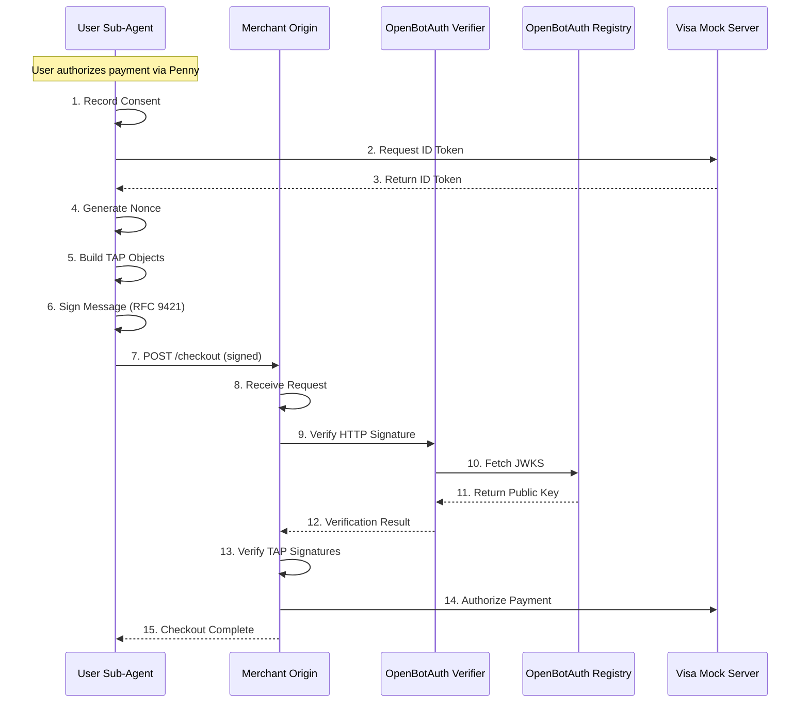

# TAP Voice Agents: Visa-Style Agentic Commerce with OpenBotAuth

## Demo (2 mins)

<p align="center">
  <a href="https://youtu.be/1ZPB_n6v6EI" target="_blank">
    
    <br>
    
  </a>
</p>

A working implementation of autonomous agent-to-merchant payments using cryptographic identity and consent proofs.

**Core Concept**: This demo shows how commerce will work when users have their own AI agents. Pete and Penny are **user-owned sub-agents** that live in your browser/OS (like extensions or system services), not on merchant websites. They shop and pay on your behalf, using cryptographic signatures to prove identity and consent to merchants.

---

## Overview

When users have their own AI agents, how do payments work? This demo implements a complete cryptographic flow for agent-to-merchant transactions:

- **User-Owned Agents**: Two AI agents (Pete for shopping, Penny for payments) that run client-side and act on the user's behalf
- **Cryptographic Identity**: RFC 9421 HTTP Message Signatures with Ed25519 keys prove agent identity to merchants
- **Consent Proofs**: Application-level signatures on `userConsentProof` and `paymentRequest` objects prove user authorization
- **Origin-First Verification**: Merchants verify signatures directly using OpenBotAuth (no CDN/proxy required)
- **Live Flow Visualization**: 15-step sequence diagram shows the complete cryptographic handshake

### What This Solves

**The Problem**: When AI agents shop and pay on behalf of users, merchants need to:
1. Verify the agent's identity (who are you?)
2. Confirm user authorization (did the user actually approve this?)
3. Trust the payment details (is this request authentic?)

**The Solution**: Cryptographic signatures at three layers:
- ✅ **HTTP Message Signature (RFC 9421)**: Proves the request came from a specific agent
- ✅ **User Consent Proof Signature**: Proves the user authorized this specific action
- ✅ **Payment Request Signature**: Proves the payment details haven't been tampered with
- ✅ **Shared Nonce**: Single nonce across all three layers prevents replay/mix-and-match attacks

**Why It Matters**:
- No cookies, sessions, or OAuth flows needed
- Agents can be stateless (sign and forget)
- Merchants verify directly (no third-party dependencies)
- Works across any network topology (CDN-agnostic)

### Implementation

**Backend** (Node.js + TypeScript + Express):
- Ed25519 signing with `@oba-demos/signing-ts`
- RFC 9421 HTTP Message Signature generation
- Application-level object signing (consent + payment)
- OpenBotAuth verifier integration
- Mock merchant + Visa endpoints
- Server-Sent Events for live flow visualization

**Frontend** (React + Vite + TypeScript):
- ElevenLabs voice agent integration (Pete + Penny)
- Live 15-step sequence diagram (SVG-based)
- Real-time SSE connection to backend
- Browser-native agent UI (styled like extensions)

---

## Architecture

```
┌─────────────────────────────────────────────────────────────┐
│                     User Browser                            │
│  ┌────────────────┬──────────────┬────────────────────┐    │
│  │ Product Grid   │ Cart Panel   │ Voice Interface    │    │
│  │ (Shopping)     │ (Glass UI)   │ (Pete/Penny)       │    │
│  └────────────────┴──────────────┴────────────────────┘    │
│  ┌──────────────────────────────────────────────────────┐  │
│  │ Live Sequence Diagram (15 Steps)                     │  │
│  │ Agent → Merchant → OBA Verifier → OBA Registry → Visa│  │
│  └──────────────────────────────────────────────────────┘  │
└─────────────────────────────────────────────────────────────┘
                            ↕ SSE Events
┌─────────────────────────────────────────────────────────────┐
│              TAP Voice Agents Backend (Node.js)             │
│  ┌──────────────┬──────────────┬──────────────────────┐    │
│  │ Cart API     │ Checkout API │ Payment API          │    │
│  │ Consent API  │ Merchant API │ ElevenLabs Webhooks  │    │
│  └──────────────┴──────────────┴──────────────────────┘    │
└─────────────────────────────────────────────────────────────┘
         ↕ RFC 9421                    ↕ Verification
┌──────────────────────┐      ┌─────────────────────────────┐
│ OpenBotAuth Verifier │←────→│ OpenBotAuth Registry        │
│ (verifier.           │      │ (api.openbotauth.org/jwks/) │
│  openbotauth.org)    │      │                             │
└──────────────────────┘      └─────────────────────────────┘
         ↕ Authorization
┌──────────────────────┐
│ Visa Mock Server     │
│ (Internal Demo)      │
└──────────────────────┘
```

**Key Architectural Points**:

1. **User Sub-Agents**: Pete and Penny are the **user's agents**, not the merchant's. In this demo they appear embedded in the website UI, but they always act on behalf of the user (like a browser extension or wallet agent would).

2. **Origin-First Verification**: The merchant backend acts as the origin server, calling the OBA verifier directly. No CDN proxy is required—this demonstrates OpenBotAuth's CDN-agnostic design.

3. **Agent Identity**: The user's sub-agents use a single Ed25519 keypair registered with the OBA registry. The public key is published via JWKS at `https://api.openbotauth.org/jwks/[username].json`.

4. **Application-Level Objects**: The `userConsentProof` and `paymentRequest` objects are demo-local JSON structures, not part of the core OBA protocol. They demonstrate how application-level signatures can be layered on top of RFC 9421.

5. **Shared Nonce**: A single nonce is generated at checkout initiation and used across all three signature layers (HTTP Message Signature + 2 signed objects) to prevent replay attacks.

---

## Payment Flow Sequence Diagram

The demo visualizes all 15 steps of the TAP-style payment flow in real-time:



### Step-by-Step Breakdown

1. **Record Consent**: Penny captures user's verbal authorization and stores consent proof
2. **Request ID Token**: Agent requests identity token from Visa (mock JWT for demo)
3. **Return ID Token**: Visa returns identity token to agent
4. **Generate Nonce**: Agent creates shared nonce and timestamps for all signature layers
5. **Build TAP Objects**: Agent constructs `agenticConsumer` and `agenticPaymentContainer` payloads
6. **Sign Message (RFC 9421)**: Agent signs HTTP request and both TAP objects with Ed25519 key
7. **POST /checkout**: Agent sends signed request to merchant origin
8. **Receive Request**: Merchant parses incoming request and extracts signature headers
9. **Verify HTTP Signature**: Merchant calls OBA verifier to validate RFC 9421 signature
10. **Fetch JWKS**: OBA verifier retrieves agent's public key from OBA registry
11. **Return Public Key**: OBA registry returns JWKS to verifier
12. **Verification Result**: OBA verifier confirms signature validity to merchant
13. **Verify TAP Signatures**: Merchant validates application-level signatures on TAP objects
14. **Authorize Payment**: Merchant calls Visa to authorize transaction
15. **Checkout Complete**: Merchant returns order confirmation to agent

---

## Setup Guide

### Prerequisites

1. **Node.js 20+** and **pnpm 8+**
2. **OpenBotAuth Keys**: Register at [https://registry.openbotauth.org](https://registry.openbotauth.org)
3. **ElevenLabs Account** (optional, for voice): Get API key from [https://elevenlabs.io](https://elevenlabs.io)

### Installation

```bash
# 1. Clone the repository
git clone https://github.com/hammadtq/openbotauth-demos.git
cd openbotauth-demos

# 2. Install dependencies
pnpm install

# 3. Generate and configure OBA keys
# Visit https://registry.openbotauth.org
# Register and download your key file (e.g., openbotauth-keys-username.txt)

# 4. Auto-configure backend .env
node scripts/parse-keys.js /path/to/openbotauth-keys-username.txt apps/tap-voice-agents-backend

# This will:
# - Read your OBA keys from the downloaded file
# - Use apps/tap-voice-agents-backend/.env.example as a template
# - Generate apps/tap-voice-agents-backend/.env with your keys filled in
```

### Environment Configuration

After running `parse-keys.js`, open the generated `.env` file and add ElevenLabs credentials (if using voice):

```bash
cd apps/tap-voice-agents-backend
nano .env  # or use your preferred editor
```

Add these fields:

```bash
# ElevenLabs Configuration (optional - manual controls work without these)
ELEVENLABS_API_KEY=your_api_key_here
ELEVENLABS_CART_AGENT_ID=pete_agent_id_here
ELEVENLABS_PAYMENT_AGENT_ID=penny_agent_id_here
```

**Frontend Environment** (optional, for voice):

```bash
cd apps/tap-voice-agents-frontend
cp .env.example .env
nano .env
```

Add:

```bash
VITE_ELEVENLABS_API_KEY=your_api_key_here
VITE_ELEVENLABS_CART_AGENT_ID=pete_agent_id_here
VITE_ELEVENLABS_PAYMENT_AGENT_ID=penny_agent_id_here
```

### Running the Demo

```bash
# Terminal 1: Start backend (http://localhost:8090)
pnpm dev:tap-voice-backend

# Terminal 2: Start frontend (http://localhost:5175)
pnpm dev:tap-voice-frontend
```

Open your browser to **http://localhost:5175**

---

## ElevenLabs Integration

For full voice interaction, you'll need to configure two ElevenLabs agents with custom tools.

**📋 Detailed Setup Instructions**: See [apps/tap-voice-agents-backend/ELEVENLABS_SETUP.md](apps/tap-voice-agents-backend/ELEVENLABS_SETUP.md)

**🔧 Tool Definitions (JSON)**: See [apps/tap-voice-agents-backend/ELEVENLABS_WEBHOOKS.json](apps/tap-voice-agents-backend/ELEVENLABS_WEBHOOKS.json)

### Quick Overview

**Pete (Cart Agent)** - 3 tools:
- `add_to_cart`: Add items to shopping cart
- `view_cart`: Show current cart total
- `initiate_checkout`: Start checkout and hand off to Penny

**Penny (Payment Agent)** - 3 tools:
- `get_checkout_info`: Retrieve checkout total
- `capture_consent`: Record user's verbal authorization
- `execute_payment`: Execute TAP-style signed payment

**Note**: The demo works without ElevenLabs using manual controls. Voice integration is optional but provides the full experience.

---

## User Flow

### Phase 1: Shopping with Pete (Your Shopping Sub-Agent)

Pete is **your agent** - he helps you shop but always acts in your interest, not the merchant's.

1. **Browse Products**: View 8 men's fashion items (shirts, jackets, shoes, etc.)
2. **Add to Cart**: 
   - **Voice**: "Add a white shirt to my cart"
   - **Manual**: Click "Add to Cart" button
3. **View Cart**: Side panel slides in showing items and total
4. **Initiate Checkout**:
   - **Voice**: "I'm ready to checkout"
   - **Manual**: Click "Proceed to Checkout" in cart panel

### Phase 2: Checkout with Penny (Your Payment Sub-Agent)

Penny is also **your agent** - she handles payment on your behalf and represents you to the merchant.

1. **Agent Handoff**: Pete says "Connecting you to Penny, your checkout sub-agent..."
2. **Penny Greets**: "Your checkout total is $X. Do you authorize this payment?"
3. **User Authorizes**:
   - **Voice**: Say "Yes"
   - **Manual**: Click "Authorize Payment" button
4. **Payment Execution**: Watch the live sequence diagram animate through all 15 steps
5. **Confirmation**: Penny confirms order number and transaction ID

### What Happens Behind the Scenes

**During Checkout Initiation**:
- Backend creates checkout session with 8-minute expiration
- Generates shared nonce for all signature layers
- Stores session state in memory

**During Payment Authorization**:
- Backend records consent proof with timestamp
- Builds `userConsentProof` object (includes userId, consentId, nonce, timestamps)
- Builds `paymentRequest` object (includes tokenHash, amount, merchantId, nonce, timestamps)
- Signs both objects with Ed25519 private key
- Creates RFC 9421 HTTP Message Signature with same nonce and timestamps
- Sends signed POST request to merchant endpoint

**During Merchant Verification**:
- Merchant extracts signature headers from request
- Calls OBA verifier at `https://verifier.openbotauth.org/verify`
- OBA verifier fetches public key from `https://api.openbotauth.org/jwks/[username].json`
- OBA verifier validates HTTP Message Signature
- Merchant validates application-level object signatures using public key
- Merchant verifies nonce consistency across all three layers
- Merchant verifies timestamps are within 8-minute window
- Merchant calls Visa mock for authorization
- Merchant returns order confirmation

---

## Application-Level Signed Objects

### User Consent Proof Object

```json
{
  "version": "1.0",
  "userId": "demo-user",
  "consentProofId": "consent-uuid-here",
  "nonce": "shared-nonce-base64url",
  "created": 1234567890,
  "expires": 1234568370,
  "agentId": "https://api.openbotauth.org/jwks/username.json",
  "signature": "base64-ed25519-signature"
}
```

**Purpose**: Proves that the agent is acting on behalf of a specific user with explicit consent.

**Signature Base**: `user-consent:` + canonical JSON (sorted keys, no whitespace)

**Signature Algorithm**: Ed25519 (same key as HTTP Message Signature)

### Payment Request Object

```json
{
  "version": "1.0",
  "tokenHash": "sha256-of-payment-token",
  "amount": 467,
  "currency": "USD",
  "merchantId": "DEMO_MERCHANT_001",
  "nonce": "shared-nonce-base64url",
  "created": 1234567890,
  "expires": 1234568370,
  "agentId": "https://api.openbotauth.org/jwks/username.json",
  "signature": "base64-ed25519-signature"
}
```

**Purpose**: Securely transmits payment details with proof of agent authorization.

**Signature Base**: `payment-request:` + canonical JSON (sorted keys, no whitespace)

**Signature Algorithm**: Ed25519 (same key as HTTP Message Signature)

### Shared Nonce Validation

**Critical Security Feature**: All three signature layers must use the SAME nonce:

1. HTTP Message Signature: `Signature-Input: sig1=(...);nonce="abc123";...`
2. `userConsentProof.nonce`: `"abc123"`
3. `paymentRequest.nonce`: `"abc123"`

**Merchant Verification**:

```typescript
// Extract nonce from HTTP signature
const httpNonce = parseSignatureInput(headers['signature-input']).nonce;

// Verify consistency
if (httpNonce !== body.userConsentProof.nonce ||
    httpNonce !== body.paymentRequest.nonce) {
  throw new Error('Nonce mismatch across signature layers');
}
```

This ensures that all three signatures were created in the same session and prevents mix-and-match attacks.

---

## Security Features

### Triple-Layer Signing

1. **HTTP Message Signature (RFC 9421)**: Proves the entire HTTP request came from the agent
2. **User Consent Proof Signature**: Proves the agent has user consent
3. **Payment Request Signature**: Proves the payment details are authentic

All three layers use the same Ed25519 keypair, nonce, and timestamps.

### Nonce Consistency

Single nonce across all three layers prevents:
- Replay attacks (nonce is unique per checkout session)
- Mix-and-match attacks (can't combine signatures from different sessions)
- Signature stripping (removing one signature invalidates the nonce check)

### Time-Bound Sessions

- **Checkout Session**: 8-minute expiration from initiation
- **Consent Window**: Payment must execute within 8 minutes of consent capture
- **Signature Expiration**: All three signatures expire simultaneously
- **Clock Skew Tolerance**: ±5 minutes allowed between client and verifier

### Origin-Side Verification

- Merchant controls where and how verification happens
- No CDN lock-in or proxy requirements
- Direct call to OBA verifier service
- Merchant can add additional validation logic

---

## Development Notes

### In-Memory Storage

**Current Implementation** (demo purposes):
- Cart sessions: `Map<sessionId, CartState>`
- Checkout sessions: `Map<checkoutId, CheckoutSession>`
- Consent proofs: `Map<checkoutId, ConsentProof>`

**Production Requirements**:
- Use Redis for session storage
- Use PostgreSQL for consent proofs (audit trail)
- Implement session cleanup/expiration

### Mock Visa

The demo includes a mock Visa authorization endpoint that always approves transactions (configurable via `MOCK_VISA_ALWAYS_APPROVE=true`).

**Mock Response**:

```json
{
  "approved": true,
  "transactionId": "TXN-1234567890",
  "authCode": "AUTH-ABC123",
  "timestamp": 1234567890
}
```

### SSE Events

Backend emits Server-Sent Events for real-time frontend updates:

```typescript
// Event types
type StepEvent = 
  | { type: 'step_start', stepId: string, phase: string, timestamp: number }
  | { type: 'step_complete', stepId: string, phase: string, data: any }
  | { type: 'step_error', stepId: string, error: string }
  | { type: 'cart_updated', data: { items: any[], total: number } }
  | { type: 'checkout_initiated', data: { checkout_id: string, total: number } }
  | { type: 'payment_authorized', data: { consent_id: string } };
```

Frontend subscribes via `EventSource` at `/api/events/stream`.

### CORS Configuration

Backend is configured to allow requests from `FRONTEND_URL` (default: `http://localhost:5175`).

For production, update to your actual frontend domain.

---

## Production Readiness Checklist

This demo is designed for demonstration purposes. For production deployment:

### Security Hardening

- [ ] Implement Redis-backed nonce cache with expiration
- [ ] Add rate limiting on all API endpoints
- [ ] Use HTTPS for all communication
- [ ] Implement proper user authentication
- [ ] Store consent proofs in PostgreSQL with audit trail
- [ ] Add request signing for backend-to-backend calls
- [ ] Implement proper error handling and logging
- [ ] Add input validation and sanitization
- [ ] Use environment-specific secrets management

### Scalability

- [ ] Replace in-memory storage with Redis/PostgreSQL
- [ ] Add horizontal scaling for backend (stateless)
- [ ] Implement connection pooling for database
- [ ] Add CDN for frontend assets
- [ ] Implement proper session management
- [ ] Add monitoring and alerting (Datadog, New Relic, etc.)
- [ ] Implement graceful shutdown for SSE connections

### Compliance

- [ ] Add PCI DSS compliance for real payment tokens
- [ ] Implement GDPR-compliant consent storage
- [ ] Add audit logging for all payment operations
- [ ] Implement data retention policies
- [ ] Add user data export/deletion capabilities

### Testing

- [ ] Add unit tests for TAP signing/verification
- [ ] Add integration tests for payment flow
- [ ] Add E2E tests with Playwright
- [ ] Add load testing for concurrent sessions
- [ ] Add security testing (penetration testing)

---

## License

Apache-2.0 - See [LICENSE](LICENSE) for details.

---

## Acknowledgments

- Built on [RFC 9421](https://www.rfc-editor.org/rfc/rfc9421.html) HTTP Message Signatures
- Integrates with [OpenBotAuth](https://github.com/hammadtq/openbotauth) ecosystem
- Inspired by [Visa Trusted Agent Protocol (TAP)](https://github.com/visa/trusted-agent-protocol)
- Voice agents powered by [ElevenLabs](https://elevenlabs.io)

---

**Made for the agent economy** 🤖

